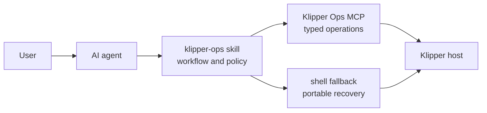

# 3D Printing Ops

An AI-agent skill marketplace for practical 3D-printing operations.

The marketplace currently ships `klipper-ops`: a tool-agnostic skill plus a
local MCP server and portable shell fallbacks for calm, bounded Klipper host
work. The skill teaches an agent when and why to act; MCP performs typed printer
operations with explicit safety gates.

## Why Skill And MCP



| Layer | Owns |
| --- | --- |
| Skill | Use cases, diagnostic order, confirmation policy, interpretation, and response shape. |
| MCP | Config parsing, SSH transport, structured output, bounds, allowlists, staging, atomic apply, health checks, and rollback. |
| Shell fallback | Plug-and-play operation when MCP is unavailable, plus focused recovery SSH. |

There is intentionally no arbitrary SSH MCP tool. Raw `ssh.sh` stays a visible,
local fallback for unusual recovery work.

## Capabilities

- Compact host, Moonraker print, config, and systemd service state.
- Bounded logs for one allowlisted service.
- Remote config manifests and local/remote diffs.
- Atomic config pulls that remove stale local files.
- Timestamped backups and isolated Klipper config validation.
- Two-phase config changes: prepare and review, then explicitly apply.
- Atomic remote directory swap, service health check, and automatic rollback.
- Idle-gated allowlisted service restarts and named backup restores.
- Portable workspace initialization and shell wrappers.

Out of scope: slicer profiles, slicer application settings, firmware flashing,
and broad printer-tuning methodology.

## Quick Start

### 1. Install The Skill

Ask a compatible skill installer for:

```text
repo: anton-kostryukov/3d-printing-ops
path: skills/klipper-ops
ref: 0.3.0
```

Manual install:

```bash
git clone --branch 0.3.0 https://github.com/anton-kostryukov/3d-printing-ops.git
mkdir -p "${CODEX_HOME:-$HOME/.codex}/skills"
cp -R 3d-printing-ops/skills/klipper-ops "${CODEX_HOME:-$HOME/.codex}/skills/klipper-ops"
```

Other agents can keep `skills/klipper-ops` in any stable skills directory. The
skill itself has no dependency on Codex.

### 2. Install The MCP Server

Install the release-pinned Python package with your preferred isolated tool:

```bash
pipx install "git+https://github.com/anton-kostryukov/3d-printing-ops.git@0.3.0#subdirectory=mcp/klipper-ops-server"
# or
uv tool install "git+https://github.com/anton-kostryukov/3d-printing-ops.git@0.3.0#subdirectory=mcp/klipper-ops-server"
```

The server requires Python 3.11+ and provides the `klipper-ops-mcp` command. It
uses the stable MCP Python SDK 1.x line and pins `<2` to avoid an implicit major
upgrade.

### 3. Initialize A Printer Workspace

```bash
mkdir my-printer
cd my-printer
export KLIPPER_OPS_SKILL_DIR="${CODEX_HOME:-$HOME/.codex}/skills/klipper-ops"
"$KLIPPER_OPS_SKILL_DIR/scripts/init-project.sh" \
  --host printer.local \
  --user pi \
  --name my-printer \
  --with-wrappers
```

Run a shell-fallback check:

```bash
./scripts/status.sh
./scripts/logs.sh klipper 15 120
./scripts/pull-config.sh
```

## Connect An AI Agent

Run one MCP server per printer workspace. Give it an absolute workspace path via
`KLIPPER_OPS_PROJECT_ROOT`.

### Codex

```bash
codex mcp add klipper-ops \
  --env KLIPPER_OPS_PROJECT_ROOT=/absolute/path/to/my-printer \
  -- klipper-ops-mcp
```

### Claude Code

```bash
claude mcp add --scope local klipper-ops \
  --env KLIPPER_OPS_PROJECT_ROOT=/absolute/path/to/my-printer \
  -- klipper-ops-mcp
```

### Gemini CLI

```bash
gemini mcp add klipper-ops klipper-ops-mcp \
  --env KLIPPER_OPS_PROJECT_ROOT=/absolute/path/to/my-printer
```

### Cursor And Generic MCP Clients

Create `.cursor/mcp.json`, `.gemini/settings.json`, `.mcp.json`, or the client’s
equivalent stdio configuration:

```json
{
  "mcpServers": {
    "klipper-ops": {
      "command": "klipper-ops-mcp",
      "args": [],
      "env": {
        "KLIPPER_OPS_PROJECT_ROOT": "/absolute/path/to/my-printer"
      }
    }
  }
}
```

Add a project rule (`AGENTS.md`, `CLAUDE.md`, `GEMINI.md`, or Cursor rule) with a
small policy:

```markdown
Use the klipper-ops skill and MCP tools for printer host work. Start with compact
status or bounded logs. Before config writes, prepare a plan, show its diff and
backup ID, and wait for explicit user confirmation before applying it. Never
restart or apply while a print is active.
```

## Configuration

Printer settings live in the printer workspace. Both MCP and shell fallbacks
read these files as dotenv data, without executing shell code:

1. `.env`
2. `.klipper-ops.env`
3. `.klipper-ops.local.env`
4. exported process environment, which has final precedence

Minimum configuration:

```bash
PRINTER_HOST="printer.local"
PRINTER_USER="pi"
```

Common overrides:

```bash
PRINTER_NAME="my-printer"
PRINTER_REMOTE_CONFIG_DIR="/home/pi/printer_data/config"
PRINTER_KLIPPER_CHECK_SCRIPT="/home/pi/klipper/scripts/check_config.py"
PRINTER_SERVICES="klipper moonraker nginx crowsnest"
PRINTER_SYSTEMCTL_SCOPE="system"
KNOWN_HOSTS_PATH=".known_hosts"
SSH_ASKPASS_PATH="/absolute/path/to/askpass.sh"
KLIPPER_OPS_SSH_TIMEOUT="30"
KLIPPER_OPS_PLAN_TTL_SECONDS="3600"
```

Use `.klipper-ops.local.env` for machine-local paths. Do not commit passwords,
private keys, askpass scripts, backups, or printer config mirrors containing
secrets.

## MCP Tools

| Tool | Purpose |
| --- | --- |
| `get_printer_status` | Structured host, print, config, and service snapshot. |
| `get_service_logs` | Bounded logs for one allowlisted service. |
| `get_config_manifest` | Remote manifest and fingerprint. |
| `diff_config` | Local/remote added, modified, and deleted paths. |
| `pull_config` | Atomic local mirror refresh. |
| `backup_config` | Local backup with JSON metadata. |
| `validate_config` | Isolated staged Klipper config check. |
| `prepare_config_apply` | Backup, diff, stage, validate, and create an expiring plan. |
| `apply_config` | Confirmed atomic apply, restart, health check, and rollback. |
| `restart_service` | Confirmed idle-gated allowlisted restart. |
| `restore_backup` | Confirmed restore of a named backup. |

Write tools reject active prints. Unknown print state also blocks writes unless the
user explicitly approves the recovery-only override.

## Shell Fallback

| Script | Purpose |
| --- | --- |
| `init-project.sh` | Create workspace env, directories, and wrappers. |
| `status.sh` | Compact systemd and config snapshot. |
| `logs.sh` | Bounded service logs. |
| `pull-config.sh` | Atomic config mirror refresh. |
| `pull-config-expanded.sh` | Atomic expanded mirror refresh. |
| `backup-config.sh` | Timestamped config backup. |
| `check-config.sh` | Focused remote Klipper config check. |
| `push-config.sh --yes` | Backup, stage, validate, and atomically replace config. |
| `restart-service.sh --yes SERVICE` | Idle-gated service restart. |
| `ssh.sh` | Focused recovery-only SSH command. |

The shell push does not restart Klipper automatically. Review its local backup and
remote rollback path, then use the guarded restart script when appropriate.

## Development

```bash
python3 -m venv .venv
.venv/bin/python -m pip install -e './mcp/klipper-ops-server[dev]'
.venv/bin/pytest mcp/klipper-ops-server
bash tests/test-shell.sh
python3 scripts/validate-project.py
```

Also run the `skill-creator` `quick_validate.py` against
`skills/klipper-ops` before publication.

## Release Contract

- Use GitHub Flow with short-lived branches and `main` as the primary branch.
- Release only functionality and bugfixes; docs/process-only changes stay under
  `Unreleased` unless they accompany functional work.
- `VERSION`, package metadata, skill metadata, marketplace version/source ref,
  changelog, README, git tag, and GitHub Release must agree.
- The release tag has no prefix and exactly equals `VERSION`.

Current version: `0.3.0`.
